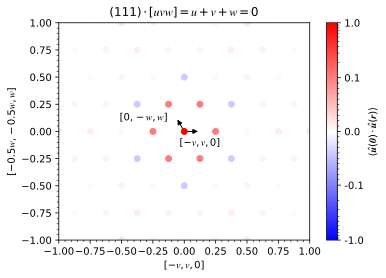
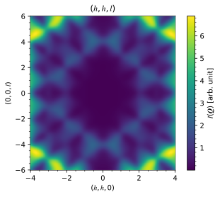

# **Displacement ice**

Analogous to spin ice, atomic displacements along the vertices of the tetrahedra of a pyrochlore lattice can also be frustrated. Using the forward Monte Carlo method, the Hamiltonian

\\[E=K\sum_{\langle i,j\rangle}(\pmb{u}\_i-\pmb{u}\_j)^2\\]

is used to describe the nearest neighbor interactions where the spring constant is great than zero ($$K>0$$). The displacement vectors $$\pmb{u}$$ of the $$\mathrm{Ho}$$ atoms are restricted to allow atomic displacements either in or out of the vertex of each tetrahedra which corresponds to the $$\langle111\rangle$$ family of directions.

 
Example of pyrochlore lattice with displacive disorder

The displacement-pair correlations of an $$8\times8\times8$$ supercell are obtained from a forward Monte Carlo simulation. The first nearest neighbors are clearly positive while the second are negative.

 
Displacement-pair correlations

The diffuse scattering intensity is calculated over a range of -6 to 6 in each $$h$$-, $$k$$-, and $$l$$-direction with a bin size of 0.04 in each dimension. Averaging is done over 20 independent forward Monte Carlo simulations to improve the statistics. A slice in the $$(h,h,l)$$-plane is also calculated from -4 to 4 in the $$[h,h,0]$$-direction -6 to 6 in the $$[0,0,l]$$-direction.

 
Diffuse scattering intensity

