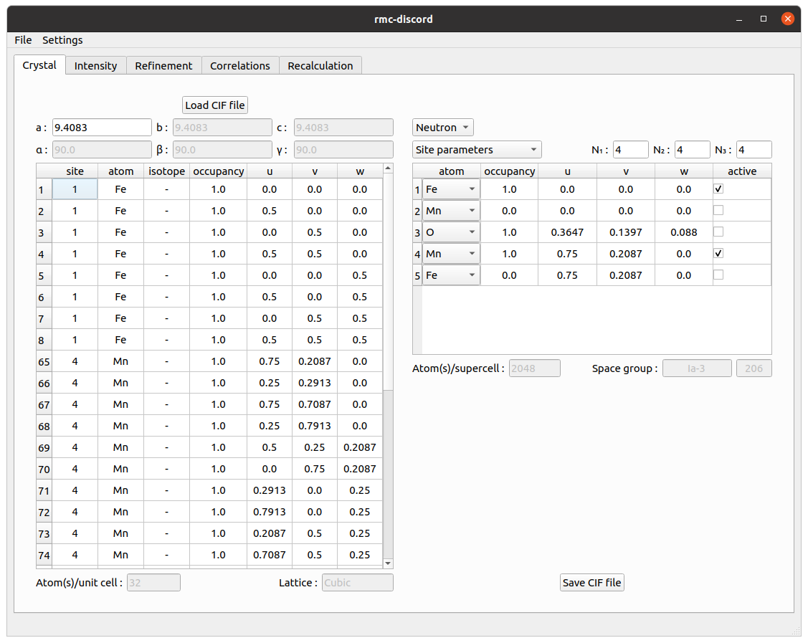

# **Bixbyite -- magnetic**

## **RMC refinement**

There are four main steps to performing a reverse Monte Carlo refinement:
1. Define a supercell
2. Load and preprocess a diffuse scattering intensity dataset
3. Setup and perform a refinement
4. Calculate and visualize the correlations

### **Crystal tab**

To define a supercell, it is first necessary to construct a unit cell from the average structure.

1. Begin by loading a crystallographic information file (CIF) or magnetic CIF file
  - The button is located on the upper left corner of window *Load CIF*.
  - The parameters are extracted from the CIF file and populated into two tables.
    - The left hand table displays all atoms in the unit supercell.
    - The right hand table gives the basic atom site information.
        - Modifying the atom site information on the right automatically updates the unit cell table on the right.
2. Modify (if necessary) the atom site table
  - Begin by choosing between *Neutron* and *X-ray* refinement in the upper right combo box.
     - By selecting refinement type first, the relevant parameters are available to edit including nuclei and ions.
        - For magnetic refinement, *Neutron* must be selected to access magnetic information.
     - To display, different parameters, choose from *Site parameters*, *Structural parameters*, and if available *Magnetic parameters*.
        - In *Site parameters*, along with the atom (isotope for neutron, ion for X-ray), its occupancy and fractional coordinates $$u$$, $$v$$, $$w$$ can be modified.
          An atom may also be de-activated or activated for refinement.
        - In *Structural parameters*, the anisotropic displacement parameters $$U_{ij}$$ may be modified.
          The equivalent isotropic parameter $$U_\text{iso}$$ and its principal components will be updated ($$U_1$$, $$U_2$$, $$U_3$$).
          If available, *Magnetic parameters* allows the magnetic ion to be chosen along with the magnetic moment component along the crystal axes.
          If a valid  `.mcif` is used, the magnetic symmetry will be accounted for. The $$g$$-factor can also be specified.
     - Select *Magnetic parameters*, choose $$\mathrm{Fe3+}$$ and $$\mathrm{Mn3+}$$ ions and deactivate site 3 since oxygen is nonmagnetic.
     - Create a supercell with size $$N_1=4$$, $$N_2=4$$, and $$N_3=4$$ by entering the number of cells along each crystal axes.
3. Optionally save the CIF file of the supercell and visualize it in external program [VESTA](https://jp-minerals.org/vesta/en/)

 
Crystal tab

**Hints**
- The size of the supercell defines the maximum resolution of the refined reciprocal space pattern.
  - A larger supercell is needed to refine finer reciprocal space features.
    - Along each dimension $$i$$, the resolution in reciprocal lattice units is $$1/N_i$$.
  - Start with a small number (e.g. $$4\times4\times4$$) and increase as needed.
    - Too large of a supercell uses more memory and takes longer to refine.
    - Too small of a supercell may not resolve the diffuse scattering features.

### **Intensity tab**

Once a supercell is defined, the experimental data can be loaded and preprocessed for refinement

1. Load a NeXus (NXS) with the diffuse scattering data
  - The button is located on the upper left corner of window *Load NeXus file*.
  - The loaded data are displayed as three separate reciprocal space slices: $$(0kl)$$, $$(h0l)$$, and $$(hk0)$$.
    - The table displays the binning information along each reciprocal space dimension.
    - The tabs give basic options for rebinning, cropping, and punching out Bragg peaks.
2. View the data
  - In the upper left corner of the plots, select between the *Intensity* and *Error*.
  - In the lower right corner of the plots, choose between *Linear* and *Logarithmic* scaling.
  - Change the *Min* and *Max* limits of the colorbar.
  - Change the index of the slices displayed for $$h$$, $$k$$, and $$l$$.
3. Rebin and crop the data (if necessary)
  - The table can be directly modified updating the *size*, *min*, and *max* values.
  - The *Rebin* tab gives binning options that bins the data into equal sizes.
     - The *Centered at integer* check boxes give only the options where the binning is centered over each integer $$h$$, $$k$$, and $$l$$.
  - The *Crop* table allows the $$h$$-, $$k$$-, and $$l$$-range to be specified.
     - The *Reset* button resets the binning and cropping to the original values of the loaded data.
  - Rebin the data to $$0.08\times0.08\times0.08$$ and crop to 0-4 along each dimension.
3. Remove the Bragg peaks
  - Select the *Centering* of the crystal (*I* for body centering).
  - Choose between *Box* and *Ellipsoid*.
  - Choose the size for each radius in number of pixels.
  - Decrease the *Outlier* parameter to remove more data.
  - The *Punch* can be done in multiple passes.
  - The removal can be *Reset*.

**Hints**
- View the data in logarithmic scale to better observe the diffuse scattering.
- Select a region of interest that covers at least the primitive features of the observed diffuse scattering.
- Check for complete Bragg peak removal by switching between linear and logarithmic scaling.
