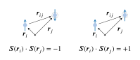
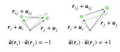

# **Diffuse scattering and correlated disorder**

In the atomistic Monte Carlo method, the diffuse scattering intensity of the supercell is recalculated after each move. The scattering intensity calculations are summarized below.

A system may be disordered due to magnetic moments, site occupancies, or atomic displacements. In general, the scattering intensity may be classified as either magnetic or structural. In the latter case, these refer to both occupational and displacive disorder types.

## **Magnetic**

The magnetic neutron scattering intensity is given by

\\[I(\pmb{Q})=\frac{C}{N}\big\langle\|\pmb{F}_\perp (\pmb{Q})\|^2\big\rangle\\]

where $$\pmb{F}_\perp (\pmb{Q})$$ is the projection of the vector structure factor in the scattering plane and $$C=0.07265 \text{ barn}$$ is a constant. The magnetic structure factor for a system composed of magnetic moments $$\pmb{M}_j$$ is obtained according to

\\[\pmb{F}(\pmb{Q})=\sum_{j}f_j(\pmb{Q})\pmb{M}_je^{i\pmb{Q}\cdot\pmb{r}_j}\\]

where $$f_j(\pmb{Q})$$ is the magnetic form factor. Spin-pair correlations that are positive indicate ferromagnetic interactions while negative indicate antiferromagnetic correlations.

 
Illustration of spin-pair correlations

## **Structural**

The diffuse scattering intensity for structural disorder is calculated by subtracting from the total scattering intensity the Bragg intensity

\\[I(\pmb{Q})=\frac{1}{N}\big\langle\|F(\pmb{Q})-\langle F(\pmb{Q})\rangle\|^2\big\rangle\\]

where $$F(\pmb{Q})$$ is the structure factor which is related to the scattering lengths $$b_j$$. Structural disorder is due to occupational and/or displacive disorder.

### **Occupational**

For sites that are partially occupied, the occupancy parameter

\\[\delta_j=\begin{cases}
1 & \text{occupied} \newline
0 & \text{unoccupied}
\\end{cases}\\]

is used to represent the local site occupancy. The structure factor is calculated according to

\\[F(\pmb{Q})=\sum_{j}b_j\delta_je^{i\pmb{Q}\cdot\pmb{r}_j}.\\]

However, if each site has average composition $$c_j$$, the relative occupancy parameter

\\[a_j=\frac{\delta_j}{c_j}-1\\]

can be used to enforce the overall composition $$c_j$$. In this case, the  structure factor is calculated according to

\\[F(\pmb{Q})=\sum_{j}b_jc_j(1+a_j)e^{i\pmb{Q}\cdot\pmb{r}_j}.\\]

These two equations for structure factor are related recognizing that $$\delta_j=c_j(1+a_j)$$. An additional relative occupancy parameter

\\[\sigma_j=\begin{cases}
+1 & \text{occupied} \newline
-1 & \text{unoccupied}
\end{cases}\\]

is used to calculate to occupancy-pair correlations. Positive correlation values indicate two sites are either both occupied or both unoccupied. Conversely, negative values indicate that one site is occupied and the other unoccupied.

 
Illustration of displacement-pair correlations

### **Displacive**

For atomic displacements $$\pmb{u}_j$$, the structure factor is given by
\\[F(\pmb{Q})=\sum_{j}b_je^{i\pmb{Q}\cdot(\pmb{r}_j+\pmb{u}_j)}.\\]
The modification of the phase factor with the atomic displacement is approximated using a Taylor expansion. The displacement-pair correlations can be calculated by normalizing each vector and taking the dot product. Positive correlations between two sites suggest the displacements are cooperative; negative means the displacements are anti-cooperative.

 
Illustration of displacement-pair correlations

### **Combined occupational-displacive**

If both site occupancies and atomic displacements are present, the structure factor takes on the form

\\[F(\pmb{Q})=\sum_{j}b_j\delta_je^{i\pmb{Q}\cdot(\pmb{r}_j+\pmb{u}_j)}\\]

when the concentration is not fixed and

\\[F(\pmb{Q})=\sum_{j}b_jc_j(1+a_j)e^{i\pmb{Q}\cdot(\pmb{r}_j+\pmb{u}_j)}\\]

when the concentration is fixed for the refinement. It is possible to calculate the vacant-displacement correlations which relate the preference for a neighboring occupied site to displace toward or away from a missing unoccupied site. This essentially takes on the form of a size-effect parameter where a positive value indicates a displacement toward a vacancy and negative value indicates a displacement towards a vacancy.

 
Illustration of vacant-displacement-pair correlations

