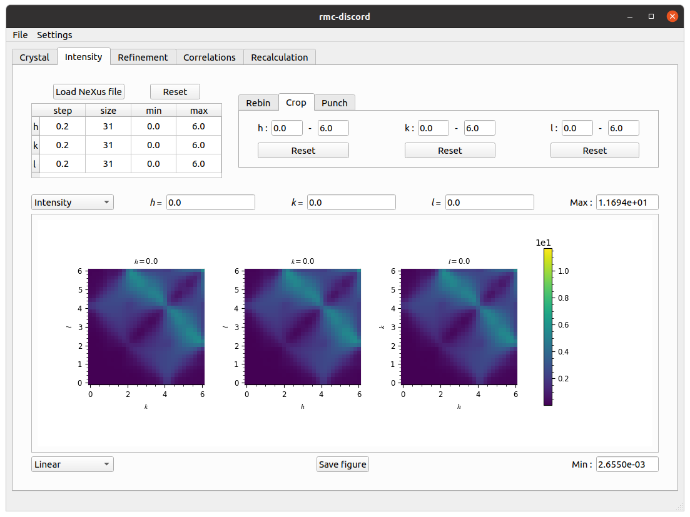

# **Displacement ice**

Analogous to spin ice, atomic displacements along the vertices of the tetrahedra of a pyrochlore lattice can also be frustrated. Using the forward Monte Carlo method, the Hamiltonian

\\[E=K\sum_{\langle i,j\rangle}(\pmb{u}\_i-\pmb{u}\_j)^2\\]

is used to describe the nearest neighbor interactions where the spring constant is great than zero ($$K>0$$). The displacement vectors $$\pmb{u}$$ of the $$\mathrm{Ho}$$ atoms are restricted to allow atomic displacements either in or out of the vertex of each tetrahedra which corresponds to the $$\langle111\rangle$$ family of directions.

 
Example of pyrochlore lattice with displacive disorder

The displacement-pair correlations of an $$8\times8\times8$$ supercell are obtained from a forward Monte Carlo simulation. The first nearest neighbors are clearly positive while the second are negative.

 
Displacement-pair correlations

The diffuse scattering intensity is calculated over a range of -6 to 6 in each $$h$$-, $$k$$-, and $$l$$-direction with a bin size of 0.04 in each dimension. Averaging is done over 20 independent forward Monte Carlo simulations to improve the statistics. A slice in the $$(h,h,l)$$-plane is also calculated from -4 to 4 along $$(h,h,0)$$ and -6 to 6 along $$(0,0,l)$$.

 
Diffuse scattering intensity

## **RMC refinement**

Setup, run, and analyze a refinement with displacive disorder.

### **Crystal tab**

Create a supercell for magnetic refinement.
* Click on *Load CIF file*, navigate to the `tutorials/pyrochlore/` directory, and locate the `pyrochlore.cif` file.
* Create a supercell with size $$N_1=4$$, $$N_2=4$$, and $$N_3=4$$.

 
Crystal tab

### **Intensity tab**

Preprocess intensity obtained from forward Monte Carlo.
* Download the [`pyrochlore-displacive.nxs`](http://dl.dropboxusercontent.com/s/waons3ako68ywra/pyrochlore-displacive.nxs?dl=00) file.
* Click on *Load NeXus file* and locate the `pyrochlore-displacive.nxs` file.
* Under the *Rebin* tab, change the step size to *0.2* in each $$h$$-, $$k$$-, and $$l$$-direction.
* Under the *Crop* tab, change the $$h$$-, $$k$$-, and $$l$$-range from *0* to *6*.

 
Intensity tab

### **Refinement tab**

Perform the refinement.
* Change the number of RMC *Cycles* to *100*.
* Change the filter size to *1.0* pixel in each $$h$$-, $$k$$-, and $$l$$-direction.
* Change the temperature prefactor to *1.00e+03* and decay constant to *1.00e-04*.
* Click on run and save refinement file.

 
Refinement tab

### **Correlations tab**

Calculate three-dimensional displacement-pair correlations.
* Under the *Three-dimensional* tab, change $h$, $k$ and $l$ to *1*.
* Change *Fraction* to *0.2*.
* Click *Calculate*.
* Change *Linear* scaling to *Logarithmic*.

 
Correlations tab

### **Recalculation tab**

Recalculate the intensity over new axes.
* In the table, change $h$ and $k$ size to *201* and $l$ size to *301*.
* Change $h$ and $k$ min to *-4* and $l$ min to *-6*.
* Change $h$ and $k$ max to *4* and $l$ max to *6*.
* Change $h$, $k$ and $l$ filter size to *3.0*.
* Change the *Axes* to *(hh0), (-kk0), (00l)*.
* Change the *Laue* symmetry to *cif* which is inferred from the loaded `pyrochlore.cif` file.
* Click *Calculate*.

 
Recalculation tab

* Navigate to *File->Save* to save all results into the refinement file.
