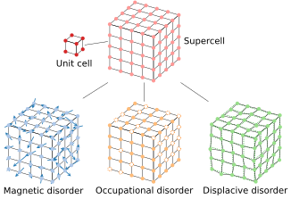

# **Reverse Monte Carlo refinement**

To calculate the diffuse scattering intensity from a disordered structure, a supercell is first generated corresponding to the average structure. Next, initially random disorder is introduced with magnetic moments or site occupancies and/or atomic displacements. The diffuse scattering intensity is then calculated from the <em>deviations</em> from the <em>average</em> structure.

 
Illustration of generating a supercell with disorder

The reverse Monte Carlo refinement methodology is bases on the Metropolis algorithm. The chi-square goodness of fit is used as the system energy which is a measure of the closeness of the calculated to the experimentally obtained diffuse scattering intensity

\\[\chi^2=\sum_{\pmb{Q}}\bigg[\frac{I_{\text{calc}}(\pmb{Q})-I_{\text{expt}}(\pmb{Q})}{\sigma_{\text{expt}}(\pmb{Q})}\bigg]^2.\\]

The acceptance ratio $$\alpha$$ follows a Boltzmann distribution

\\[\alpha=e^{-\beta\Delta{\chi^2}}\\]

which gives the likelihood of a bad move being accepted with energy change $$\Delta{\chi^2}$$ with inverse system temperature $$\beta$$. The temperature of the system is cooled according to a function analogous to Newton's law of cooling

\\[T=T_0e^{-\lambda t}\\]

where $$T_0$$ is the temperature prefactor and $$\lambda$$ is the decay constant.
