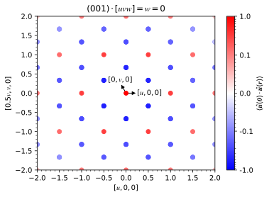
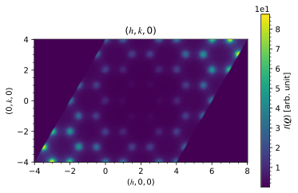
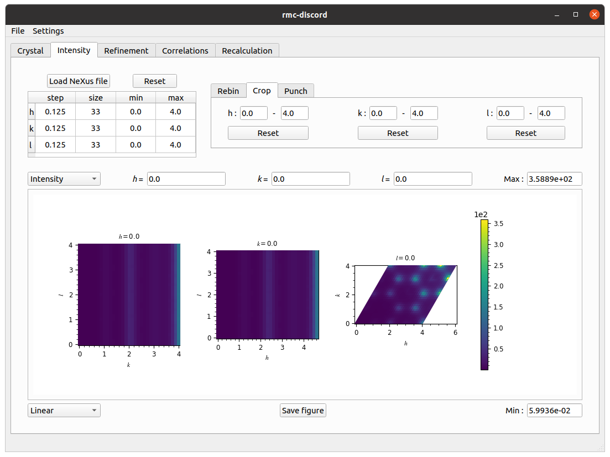
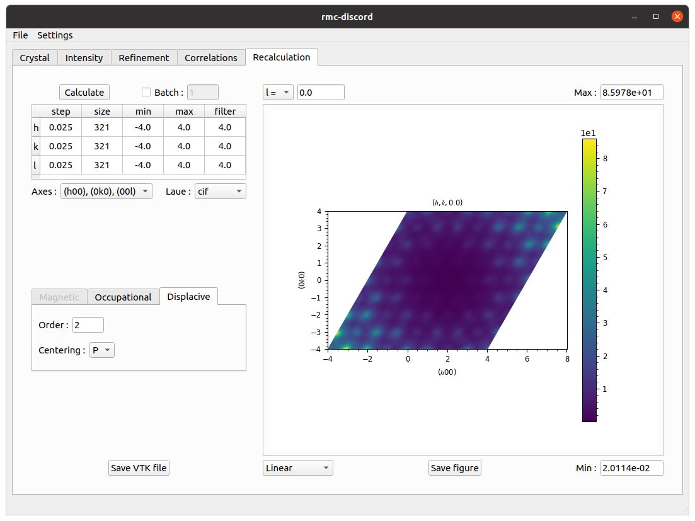

# **Honeycomb -- displacive**

The honeycomb lattice is another example that may be geometrically frustrated. Using the forward Monte Carlo method, the Hamiltonian

\\[E=K\sum_{\langle i,j\rangle}\big(\|\pmb{u}\_i-\pmb{u}\_j\|-d_{ij}\big)^2\\]

is used to describe the nearest neighbor interactions where the spring constant is great than zero ($$K>0$$) and equilibrium distance parameter is $$d_{ij}=-2\|\pmb{u}\|$$. Displacement of each atom is fixed with magnitude $$u$$ and are free to be oriented in any direction.

 
Example of honeycomb lattice with displacive disorder

The displacement-pair correlations of an $$12\times12\times12$$ supercell are obtained from a forward Monte Carlo simulation. The first nearest neighbors are clearly negatively correlated while the second are positively correlated. In the case of third nearest neighbors, the correlation is also negative.

 
Displacement-pair correlations

The diffuse scattering intensity is calculated over a range of 4 to 4 in each $$h$$-, $$k$$-, and $$l$$-direction with a bin size of 0.025 in each dimension. Averaging is done over 20 independent forward Monte Carlo simulations to improve the statistics.

 
Diffuse scattering intensity

## **RMC refinement**

Setup, run, and analyze a refinement with displacive disorder.

### **Crystal tab**

Create a supercell for nonmagnetic refinement.
* Click on *Load CIF file*, navigate to the `tutorials/honeycomb/` directory, and locate the `honeycomb.cif` file.
* Create a supercell with size $$N_1=8$$, $$N_2=8$$, and $$N_3=8$$.

 
Crystal tab

### **Intensity tab**

Preprocess intensity obtained from forward Monte Carlo.
* Download the [`honeycomb-displacive.nxs`](http://dl.dropboxusercontent.com/s/2zeiw6r5t309eml/honeycomb-displacive.nxs?dl=0) file.
* Click on *Load NeXus file* and locate the `honeycomb-displacive.nxs` file.
* Under the *Rebin* tab, change the step size to *0.125* in each $$h$$-, $$k$$-, and $$l$$-direction.
* Under the *Crop* tab, change the $$h$$-, $$k$$-, and $$l$$-range from *0* to *4*.

 
Intensity tab

### **Refinement tab**

Perform the refinement.
* Change the number of RMC *Cycles* to *100*.
* Change the filter size to *1.0* pixel in each $$h$$-, $$k$$-, and $$l$$-direction.
* Change the temperature prefactor to *1.00e+05* and decay constant to *1.00e-04*.
* Click on run and save refinement file.

 
Refinement tab

### **Correlations tab**

Calculate three-dimensional displacement-pair correlations.
* Under the *Three-dimensional* tab, change *Fraction* to *0.16*.
* Click *Calculate*.
* Change *Linear* scaling to *Logarithmic*.

 
Correlations tab

### **Recalculation tab**

Recalculate the intensity over the initial reciprocal space volume.
* In the table, change $h$, $k$ and $l$ filter size to *4.0*.
* Change the *Laue* symmetry to *cif* which is inferred from the loaded `honeycomb.cif` file.
* Click *Calculate*.

 
Recalculation tab

* Navigate to *File->Save* to save all results into the refinement file.
