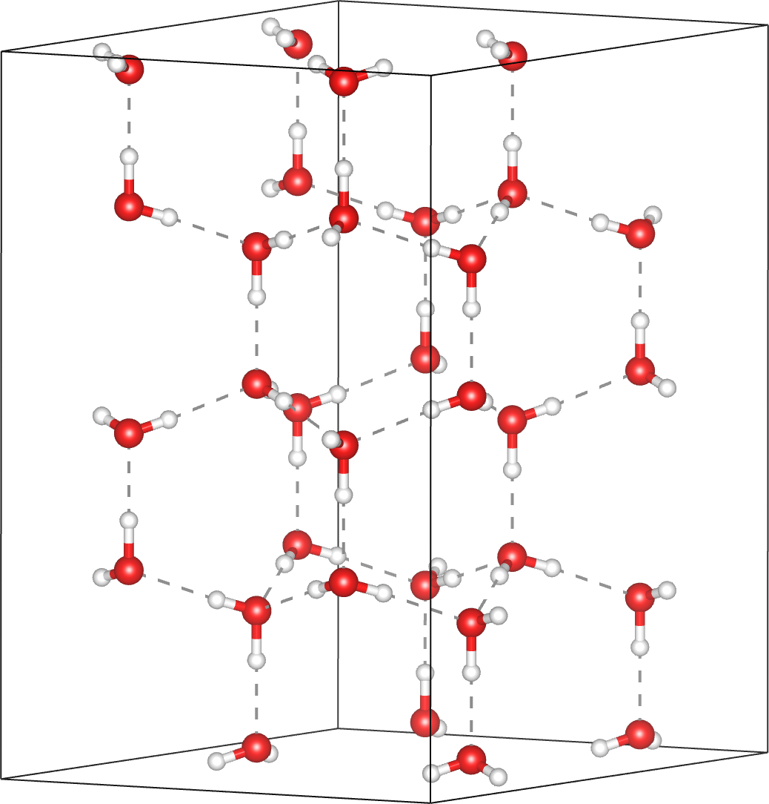

# **Hexagonal ice**

The hexagonal ice phase $$\mathrm{I_h}$$ with exhibits substantial hydrogen disorder.

 
Example of hexagonal ice phase with proton disorder

The occupancy-pair correlations of an $$8\times8\times8$$ supercell are obtained from a forward Monte Carlo simulation. The first and second nearest neighbors are clearly negative.

 
Occupancy-pair correlations

The diffuse scattering intensity is calculated over a range of -6 to 6 in each $$h$$-, $$k$$-, and $$l$$-direction with a bin size of 0.04 in each dimension. Averaging is done over 20 independent forward Monte Carlo simulations to improve the statistics.

 
Diffuse scattering intensity

