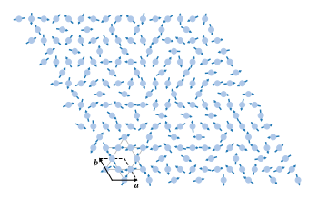
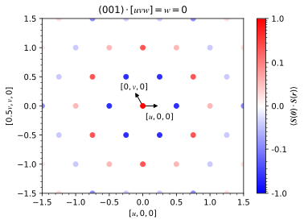
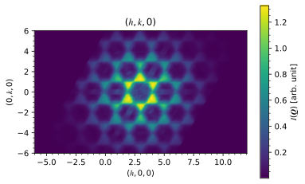

# **Kagome -- magnetic**

The classical Heisenberg kagome antiferromagnet is a simple example of a magnetic system with a geometrically frustrated lattice. Using the forward Monte Carlo method, the Hamiltonian

\\[E=-J\sum_{\langle i,j\rangle}\pmb{S}_i\cdot\pmb{S}_j\\]

is used to describe the nearest neighbor antiferromagnetic interactions where the interaction strength is less than zero ($$J<0$$). The spin vectors $$\pmb{S}$$ of the $$\mathrm{Ho^{3+}}$$ ions are free to be oriented in any direction.

 
Example of kagome lattice with magnetic disorder

The spin-pair correlations of an $$8\times8\times8$$ supercell are obtained from a forward Monte Carlo simulation. The first nearest neighbors are clearly antiferromagnetic while the second and third are ferromagnetic with the second being more strongly correlated than the third.

 
Spin-pair correlations

The diffuse scattering intensity is calculated over a range of -6 to 6 in each $$h$$-, $$k$$-, and $$l$$-direction with a bin size of 0.04 in each dimension. Averaging is done over 20 independent forward Monte Carlo simulations to improve the statistics.

 
Diffuse scattering intensity

## **RMC refinement**

Setup, run, and analyze a refinement with magnetic disorder.

### **Crystal tab**

Create a supercell for magnetic refinement.
* Click on *Load CIF file*, navigate to the `tutorials/kagome/` directory, and locate the `kagome.cif` file.
* Change the refinement from *Neutron nonmagnetic* to *Neutron magnetic*.
* Create a supercell with size $$N_1=8$$, $$N_2=8$$, and $$N_3=8$$.
* Change the atom to a $$\mathrm{Ho3+}$$ ion.

 
Crystal tab

### **Intensity tab**

Preprocess intensity obtained from forward Monte Carlo.
* Download the [`kagome-magnetic.nxs`](http://dl.dropboxusercontent.com/s/e61m0myhcca40x7/kagome-magnetic.nxs?dl=0) file.
* Click on *Load NeXus file* and locate the `kagome-magnetic.nxs` file.
* Under the *Rebin* tab, change the step size to *0.2* in each $$h$$-, $$k$$-, and $$l$$-direction.
* Under the *Crop* tab, change the $$h$$-, $$k$$-, and $$l$$-range from *0* to *6*.

 
Intensity tab

### **Refinement tab**

Perform the refinement.
* Change the number of RMC *Cycles* to *100*.
* Change the filter size to *1.0* pixel in each $$h$$-, $$k$$-, and $$l$$-direction.
* Change the temperature prefactor to *1.00e+01* and decay constant to *1.00e-04*.
* Click on run and save refinement file.

 
Refinement tab

### **Correlations tab**

Calculate three-dimensional spin-pair correlations.
* Under the *Three-dimensional* tab, change *Fraction* to *0.1* and *Tolerance* to *1e-3*.
* Click *Calculate*.
* Change *Linear* scaling to *Logarithmic*.

 
Correlations tab

### **Recalculation tab**

Recalculate the intensity over the initial reciprocal space volume.
* In the table, change $h$, $k$ and $l$ filter size to *4.0*.
* Change the *Laue* symmetry to *cif* which is inferred from the loaded `kagome.cif` file.
* Click *Calculate*.

 
Recalculation tab

* Navigate to *File->Save* to save all results into the refinement file.
