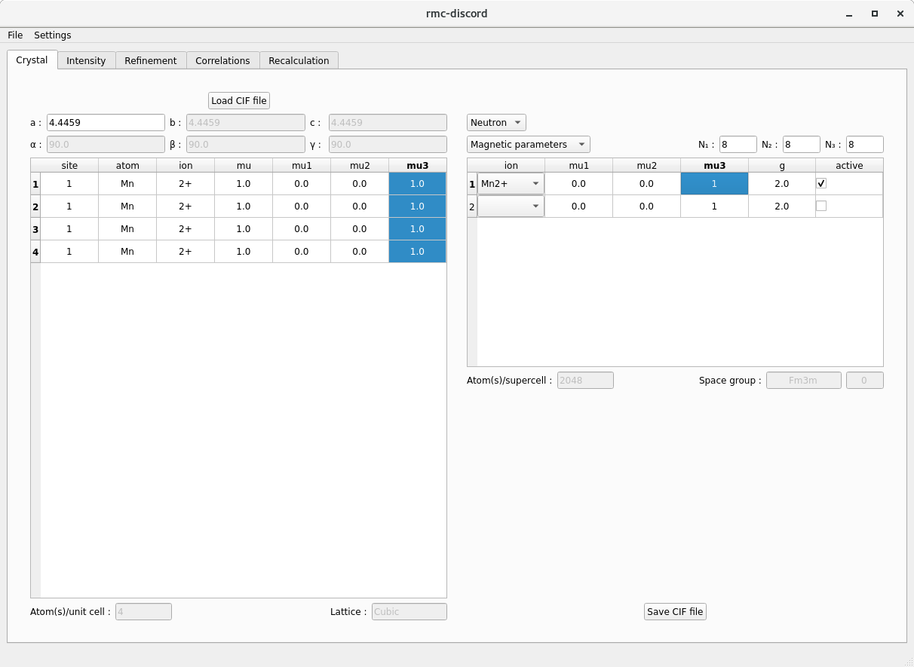
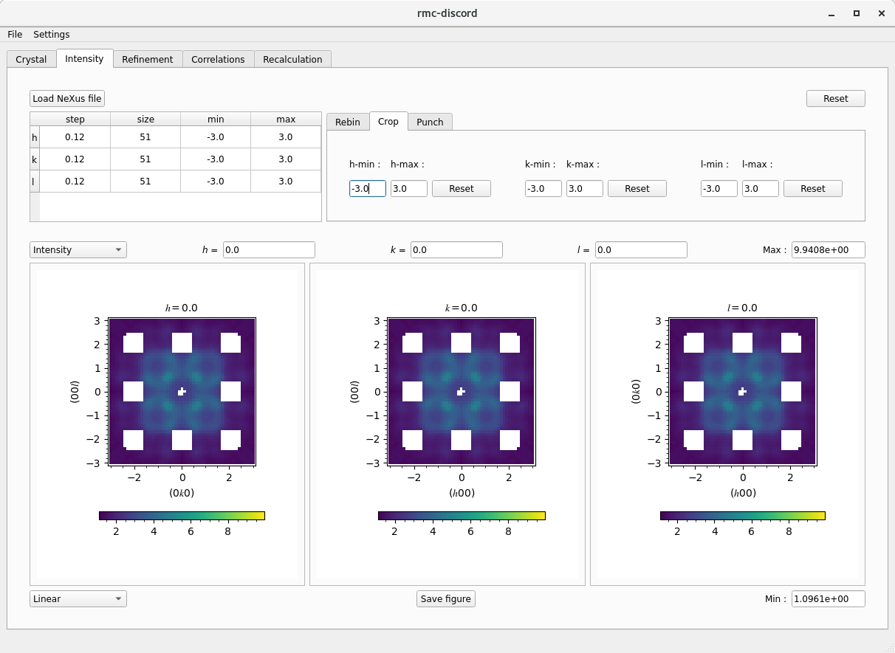
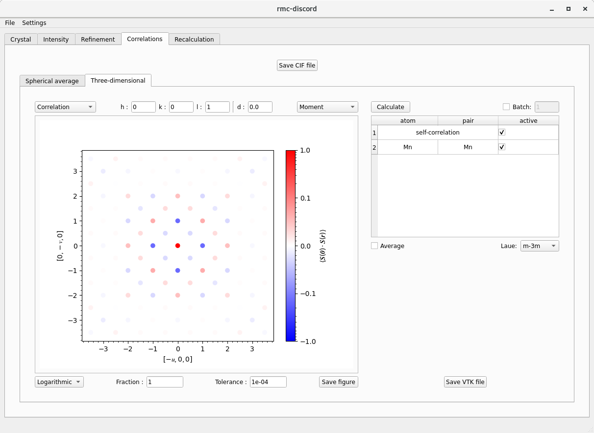

# **MnO -- magnetic**

This example is courtesy of 
[Joseph A. M. Paddison, Matthias J. Gutmann, J. Ross Stewart, Matthew G. Tucker, Martin T. Dove, David A. Keen, and Andrew L. Goodwin
Phys. Rev. B 97, 014429](https://journals.aps.org/prb/abstract/10.1103/PhysRevB.97.014429) 

### Getting started on `analysis.sns.gov`
1. Open a terminal (Ctrl+Alt+T)
2. Create a directory on your Desktop `mkdir ~/Desktop/Workshop/`
3. Copy over CIF and data files `cp /SNS/software/scd/examples/MnO.* ~/Desktop/Workshop/`
4. Launch rmc-discord `/SNS/software/scd/rmc-discord.sh`

## **RMC refinement**

There are four main steps to performing a reverse Monte Carlo refinement:
1. Define a supercell
2. Load and preprocess a diffuse scattering intensity dataset
3. Setup and perform a refinement
4. Calculate and visualize the correlations

### **Crystal tab**

To define a supercell, it is first necessary to construct a unit cell from the average structure.

1. Begin by loading a crystallographic information file (CIF) or magnetic CIF file
  - The button is located on the upper left corner of window *Load CIF*.
  - Choose `MnO.cif`.
  - The parameters are extracted from the CIF file and populated into two tables.
    - The left hand table displays all atoms in the unit supercell.
    - The right hand table gives the basic atom site information.
        - Modifying the atom site information on the right automatically updates the unit cell table on the right.
2. Modify (if necessary) the atom site table
  - Begin by choosing between *Neutron* and *X-ray* refinement in the upper right combo box.
     - By selecting refinement type first, the relevant parameters are available to edit including nuclei and ions.
        - For magnetic refinement, *Neutron* must be selected to access magnetic information.
     - To display, different parameters, choose from *Site parameters*, *Structural parameters*, and if available *Magnetic parameters*.
        - In *Site parameters*, along with the atom (isotope for neutron, ion for X-ray), its occupancy and fractional coordinates $$u$$, $$v$$, $$w$$ can be modified.
          An atom may also be de-activated or activated for refinement.
        - In *Structural parameters*, the anisotropic displacement parameters $$U_{ij}$$ may be modified.
          The equivalent isotropic parameter $$U_\text{iso}$$ and its principal components will be updated ($$U_1$$, $$U_2$$, $$U_3$$).
          If available, *Magnetic parameters* allows the magnetic ion to be chosen along with the magnetic moment component along the crystal axes.
          If a valid  `.mcif` is used, the magnetic symmetry will be accounted for. The $$g$$-factor can also be specified.
     - Select *Magnetic parameters*, choose $$\mathrm{Fe3+}$$ and $$\mathrm{Mn3+}$$ ions and deactivate site 3 since oxygen is nonmagnetic.
     - Create a supercell with size $$N_1=8$$, $$N_2=8$$, and $$N_3=8$$ by entering the number of cells along each crystal axes. 
3. Optionally save the CIF file of the supercell and visualize it in external program [VESTA](https://jp-minerals.org/vesta/en/)

 
Crystal tab

**Hints**
- The size of the supercell defines the maximum resolution of the refined reciprocal space pattern.
  - A larger supercell is needed to refine finer reciprocal space features.
    - Along each dimension $$i$$, the resolution in reciprocal lattice units is $$1/N_i$$.
  - Start with a small number (e.g. $$4\times4\times4$$) and increase as needed.
    - Too large of a supercell uses more memory and takes longer to refine.
    - Too small of a supercell may not resolve the diffuse scattering features.

### **Intensity tab**

Once a supercell is defined, the experimental data can be loaded and preprocessed for refinement

1. Load a HDF5 (H5) with the diffuse scattering data
  - The button is located on the upper left corner of window *Load NeXus file*. 
  - Choose `MnO.h5`.
  - The loaded data are displayed as three separate reciprocal space slices: $$(0kl)$$, $$(h0l)$$, and $$(hk0)$$.
    - The table displays the binning information along each reciprocal space dimension.
    - The tabs give basic options for rebinning, cropping, and punching out Bragg peaks.
2. View the data
  - In the upper left corner of the plots, select between the *Intensity* and *Error*.
  - In the lower right corner of the plots, choose between *Linear* and *Logarithmic* scaling.
  - Change the *Min* and *Max* limits of the colorbar.
  - Change the index of the slices displayed for $$h$$, $$k$$, and $$l$$.
3. Rebin and crop the data (if necessary)
  - The table can be directly modified updating the *size*, *min*, and *max* values.
  - The *Rebin* tab gives binning options that bins the data into equal sizes.
     - The *Centered at integer* check boxes give only the options where the binning is centered over each integer $$h$$, $$k$$, and $$l$$.
  - The *Crop* table allows the $$h$$-, $$k$$-, and $$l$$-range to be specified.
     - The *Reset* button resets the binning and cropping to the original values of the loaded data.
  - Rebin the data to $$0.12\times0.12\times0.12$$ and crop to -3 to 3 along each dimension.
3. The Bragg peaks are already removed

  

  
   
  Crystal tab
  

**Hints**
- View the data in logarithmic scale to better observe the diffuse scattering.
- Select a region of interest that covers at least the primitive features of the observed diffuse scattering.

### **Refinement tab**

Setup and run a refinement.

1. Choose the refinement type by selecting the *Magnetic*, *Occupational*, or *Displacive* check box
  - Under each corresponding tab is a set of options relevant to that disorder type.
  - Choose *Magnetic* and leave the check box marked for *Fixed moment*
2. Set the refinement temperature prefactor and decay constant
  - The temperature *Prefactor* is the initial temperature. 
  - Start at `1e+4`.
  - The decay *Constant* is the rate at which the temperature decreases with each move as a Newtonian cooling function. - Start at `1e-3`.
3. Choose between a single run or *Batch* job by specifying the number of runs
  - More runs can be averaged together to improve statistics.
4. Choose the Gaussian filter size for each $$h$$, $$k$$, and $$l$$ size in number of pixels
  - Using Gaussian filtering reduces the noise at the expense of increasing the time of the refinement.
  - Choose `1.0`x`1.0`x`1.0` to start.
5. Start the refinement by clicking *Run*
  - The refinement may be stopped by clicking *Stop*.
  - Once stopped, the refinement may be continued or *Reset* for a new refinement.
  - View the intensity plot type to compare the *Calculated* and *Experiment* datasets.
  - Change the slice, scaling, and colorbar limits.
  - View different refinement static plots.

 
Crystal tab

**Hints**
- One cycle is defined as the number of moves equal to the number of atoms in the supercell.
  - Typically 100 cycles is sufficient to obtain a good refinement.
- Start off with only a few cycles (e.g. 10) to check the temperature prefactor and decay constant.
  - At the beginning, the temperature needs to be high enough such that most bad moves are accepted and very few are rejected.
  - The decay rate should be cool the system gradually such that more and more bad moves are rejected, and by the end, nearly any bad moves are accepted.
  - Cooling too quickly can quench the system into a metastable state.
  - Increasing the number of cycles by 10 typically requires decreasing the decay rate by a factor of 10 to keep a similar cooling schedule.
- Increasing the number of batch jobs improves the statistics of the correlations and the recalculated diffuse scattering pattern.

### **Correlations tab**

After completing a refinement, the pair correlations can be calculated.

1. There are two tabs for calculating correlations: *Spherical average* and *Three-dimensional*
  - In each, the *Fraction* determines the largest separation vector that can be constructed multiplying this value by the longest separation vector possible in the supercell.
  - In each, the *Tolerance* corresponds to the maximum number of decimal places for distinguishing unique pairs.
    - Specifying 1e-2, for example, means that distances 0.333 and 0.334 are equivalent distances since they round to 0.33 using two decimal places.
  - The *Average* check box averages common separation vectors with different atom-pair types.
    - By unclicking *Average*, it is possible to only plot certain atom-pair types by utilizing the check boxes in the table.
  - The correlations may be saved as either a CSV file or VTK file which can be opened in external programs like [ParaView](https://www.paraview.org/) for visualization.
2. Calculate the one-dimensional and three-dimensional correlations
  - In the upper right of each tab are the different correlation options: *Magnetic*, *Occupancy*, and *Displacement*
    - Select *Magnetic* type to and click *Calculate* to obtain the correlations.
    - Increase the *Fraction* to 0.5.
  - In the upper left of each tab is the option to plot the *Correlations* or *Collinearity* (if *Magnetic* or *Displacement*).
  - In the bottom left is the option to plot in *Linear* or *Logarithmic* scale.

3. The additional options for *Three-dimensional* correlations include choosing an $$hkl$$ slice
 - Use integer $$h$$, $$k$$, and $$l$$ to specify the Miller plane.
 - Choose a distance $$d$$ from the origin where $$(hkl)\cdot[uvw]=d$$.

 
Crystal tab

**Hints**
- Start with a small *Fraction* (e.g. 0.125) and gradually increase it by small increments up to 1.0 to extend the cutoff distance of pair correlation calculation.
   - Specifying too large a fraction will take more time and consume more memory than may be available.
- Increase the *Tolerance* (e.g. 1e-4 to 1e-3) if more unique pairs by separation vector are identified than actually exist.
   - Unique pairs are identified by common atom pair type and separation distance(s).

### **Recalculation tab**

 
Crystal tab

**Hints**
- Although it is possible to recalculate the full volume of reciprocal space, it requires more time than simply calculating a slice.
  - If specifying a slice, make one of the sizes of $$h$$, $$k$$, and $$l$$ equal to 1 and set the minimum value for the slice.
- Applying *Laue* symmetry to the data can improve the recalculated pattern.
  - At most, the diffuse scattering will have at most the Laue symmetry of the crystal.
  - The nature of the short range ordering can have lower symmetry than that of the average structure.
