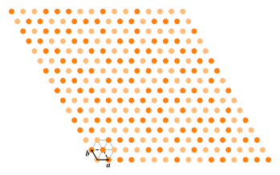
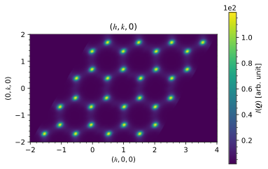
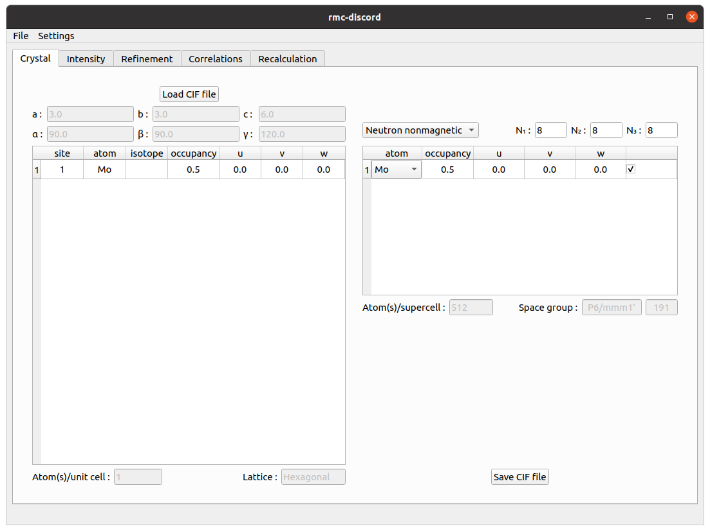
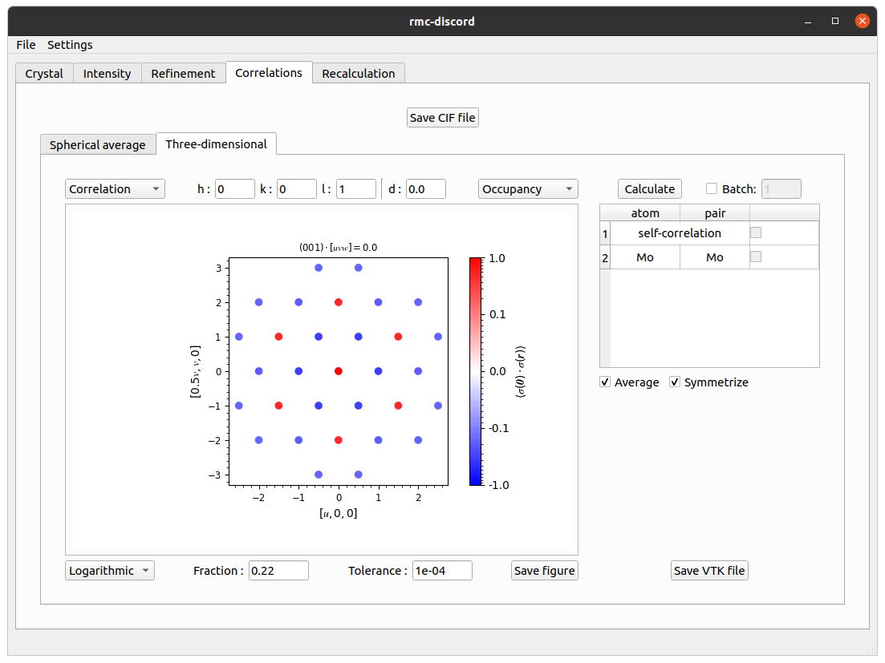

# **Triangular -- occupational**

The primitive triangular lattice is perhaps the simplest example of a geometrically frustrated lattice. Using the forward Monte Carlo method, the Hamiltonian

\\[E=-J\sum_{\langle i,j\rangle}\sigma_i\sigma_j\\]

is used to describe the nearest neighbor interactions where the interaction strength is less than zero ($$J<0$$). The occupancy parameter $$\sigma$$ indicates either the presence of an atom ($$\sigma=+1$$) or vacancy ($$\sigma=-1$$).

 
Example of triangular lattice with occupational disorder

The occupancy-pair correlations of an $$16\times16\times16$$ supercell are obtained from a forward Monte Carlo simulation. The first nearest neighbors are clearly negatively correlated while the second are positively correlated. In the case of third nearest neighbors, the correlation is also negative.

 
Occupancy-pair correlations

The diffuse scattering intensity is calculated over a range of -2 to 2 in each $$h$$-, $$k$$-, and $$l$$-direction with a bin size of 0.02 in each dimension. Averaging is done over 20 independent forward Monte Carlo simulations to improve the statistics.

 
Diffuse scattering intensity

## **RMC refinement**

Setup, run, and analyze a refinement with occupational disorder.

### **Crystal tab**

Create a supercell for nonmagnetic refinement.
* Click on *Load CIF file*, navigate to the `tutorials/triangular/` directory, and locate the `triangular.cif` file.
* Create a supercell with size $$N_1=8$$, $$N_2=8$$, and $$N_3=8$$.

 
Crystal tab

### **Intensity tab**

Preprocess intensity obtained from forward Monte Carlo.
* Download the [`triangular-occupational.nxs`](http://dl.dropboxusercontent.com/s/pezwdptghinjslj/triangular-occupational.nxs?dl=0) file.
* Click on *Load NeXus file* and locate the `triangular-occupational.nxs` file.
* Under the *Rebin* tab, uncheck the integer box and change the step size to *0.08* in each $$h$$-, $$k$$-, and $$l$$-direction.
* Under the *Crop* tab, change the $$h$$-, $$k$$-, and $$l$$-range from *0* to *2*.

 
Intensity tab

### **Refinement tab**

Perform the refinement.
* Change the number of RMC *Cycles* to *100*.
* Change the filter size to *1.0* pixel in each $$h$$-, $$k$$-, and $$l$$-direction.
* Change the temperature prefactor to *1.00e+05* and decay constant to *1.00e-04*.
* Click on run and save refinement file.

 
Refinement tab

### **Correlations tab**

Calculate three-dimensional occupancy-pair correlations.
* Under the *Three-dimensional* tab, change *Fraction* to *0.22*.
* Click *Calculate*.
* Change *Linear* scaling to *Logarithmic*.

 
Correlations tab

### **Recalculation tab**

Recalculate the intensity over the initial reciprocal space volume.
* In the table, change $h$, $k$ and $l$ filter size to *4.0*.
* Change the *Laue* symmetry to *cif* which is inferred from the loaded `triangular.cif` file.
* Click *Calculate*.

 
Recalculation tab

* Navigate to *File->Save* to save all results into the refinement file.
